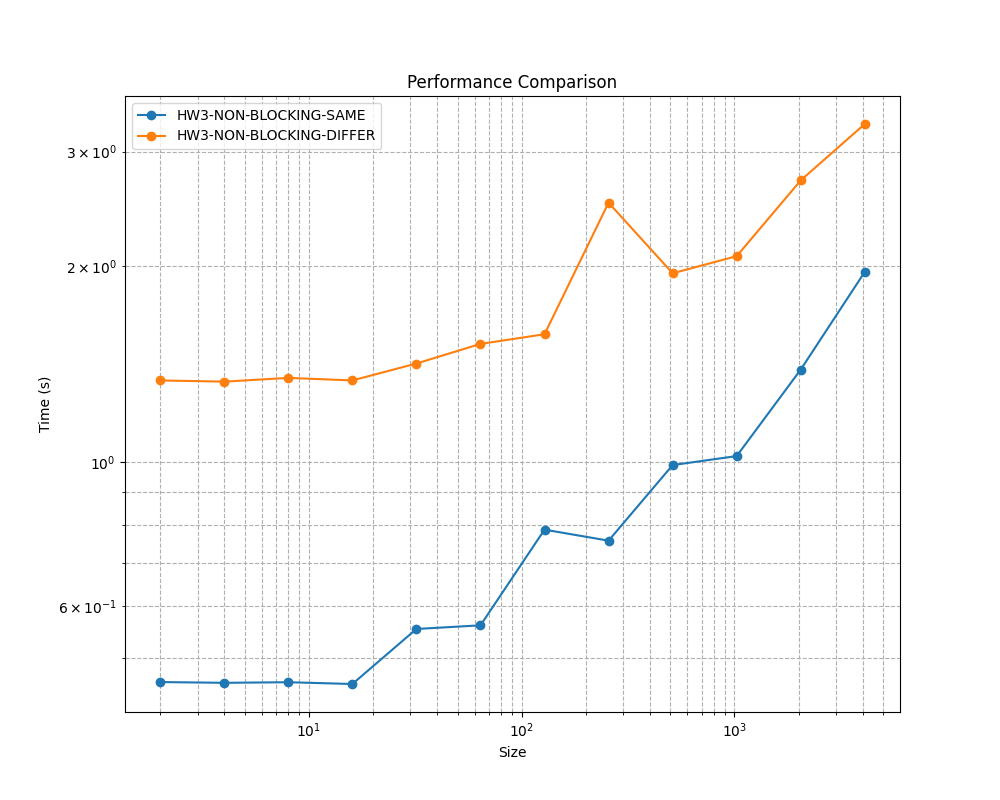
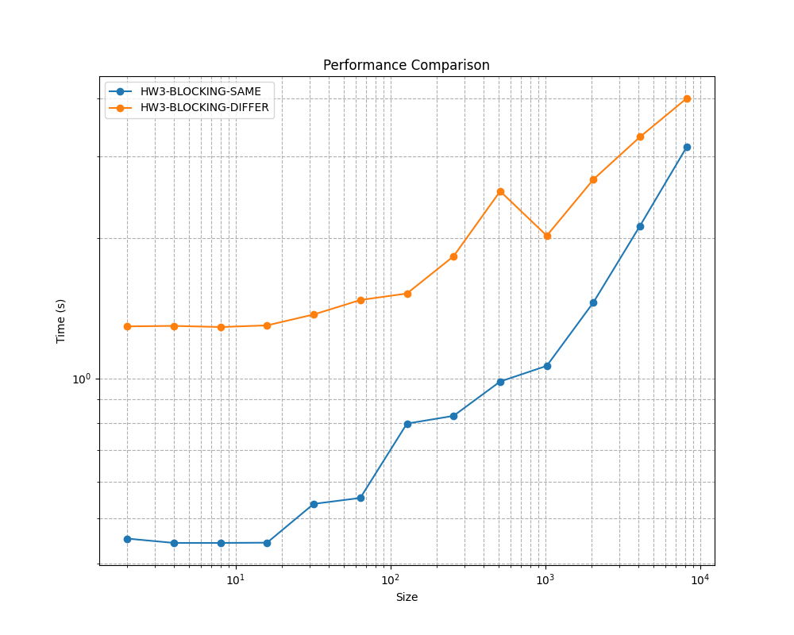
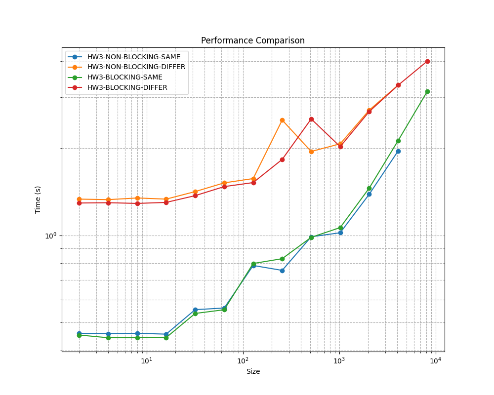
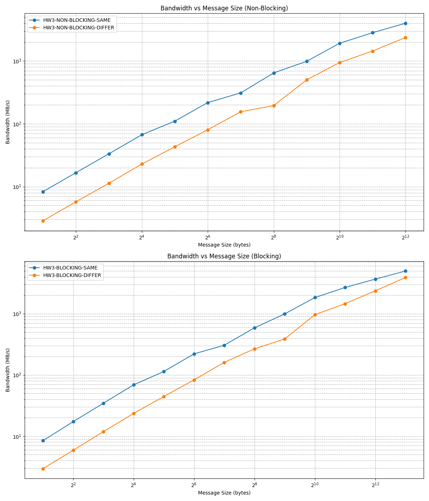
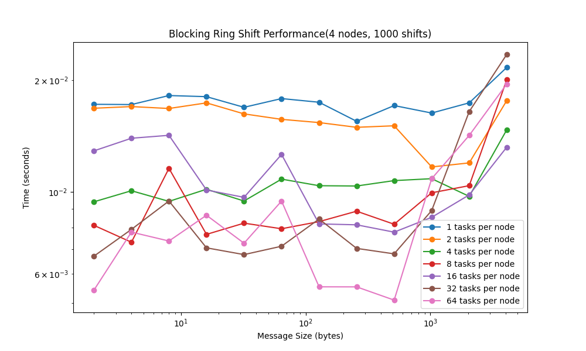
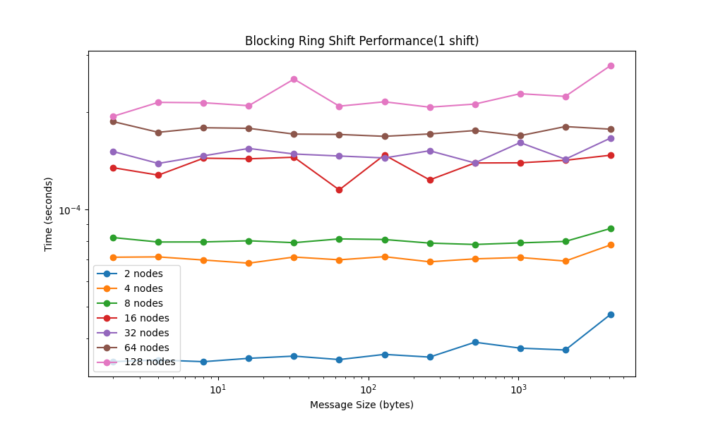
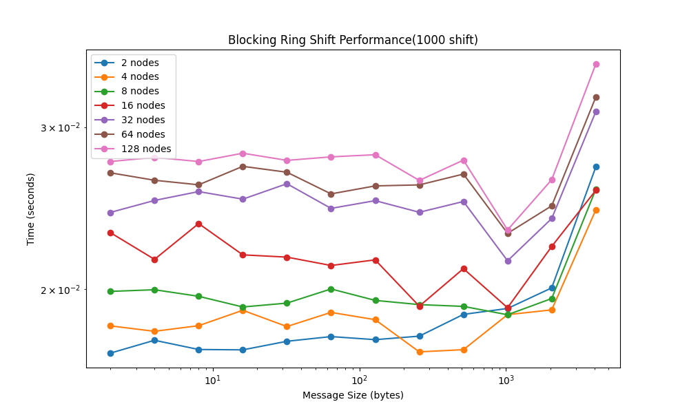
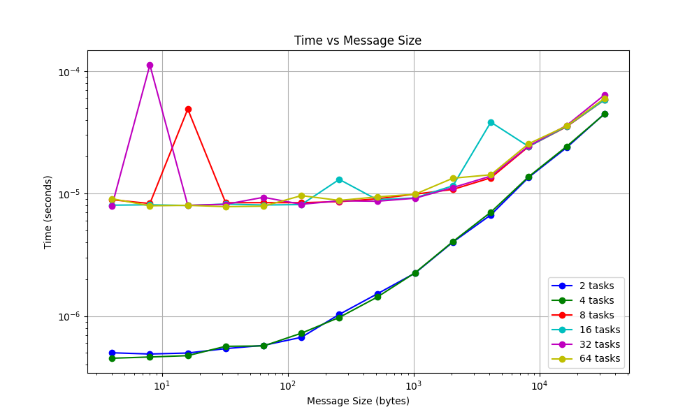
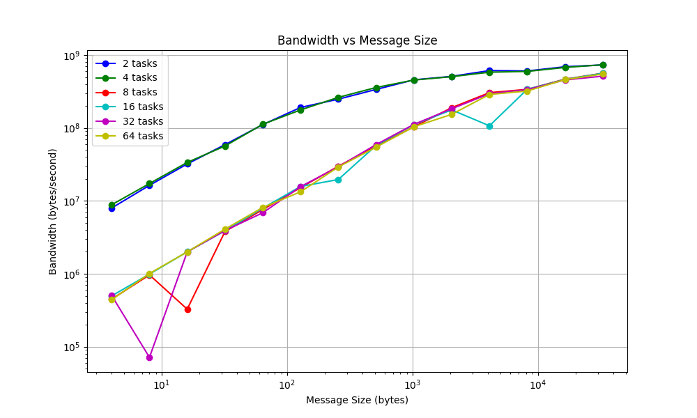

# Project 3
## Part 1 and 2: Ping-Pong
### Running the experiemnt
The implementaton of the ping-pong using MPI is available in  `ping-ping-blocking.c` and `ping-ping-non-blocking.c`.
To run the experiments required for part 1 and part 2 run the bash script `part_1_2_script.sh`.

### Results
The plots below visualize the time taken for the ping-pong exchange as a function of message size, comparing both blocking and non-blocking communication methods, and whether the communication happens within the same physical node or across different nodes.

### Analysis

- **Trend with Message Size**: For both blocking and non-blocking approaches, the time for communication increases with the size of the message. This is expected as larger messages require more time to be transmitted over the network bus. 

- **Same Node vs. Different Nodes**: Communication within the same node is significantly faster than between different nodes. This difference is due to the lower latency and higher bandwidth available within a single node. The impact of physical distance becomes more apparent as message sizes increase, leading to higher communication times for cross-node exchanges.

- **Blocking vs. Non-Blocking**: The non-blocking communication method generally shows similar or slightly higher times compared to the blocking method for smaller message sizes. However, as the message size increases, the non-blocking method can benefit from overlapped communication and computation, potentially reducing wait times. This is observed in the case of same-node communication but is less pronounced in cross-node communication due to higher network latencies.

- **Bandwidth**: Bandwidth can be inferred from the slope of the line in the log-log plot. A steeper slope indicates lower effective bandwidth because the time increases more rapidly with message size. The slope is generally steeper for different-node communication, indicating that bandwidth constraints are more significant in this scenario. 

#### Results Conclusion
 1. The non-blocking communication offers advantages in specific contexts, especially when managing large messages or when computation can be overlapped with message passing. However, the fundamental limitations of network latency and bandwidth are the primary determinants of performance.
 2. The difference between same-node and different-node communication underlines the importance of network characteristics in distributed computing environments.
 3. Our observations of bandwith trends show that bandwidth increases with message size. and while blocking and non-blocking modes show similar trends the communication within the same node achieves higher bandwidth.
 s
## Part 3: MPI Ring Shift
### Code implementation
The code for the blocking ring shift is available in the BlockingRingShiftFolder.  The main file ran was the `blockingRingShift.cpp` file.

To run the script, first compile blockingRingShift with mpicxx.  Afterwards use 

mpiexec -n [TASK_COUNT] a.out [MESSAGE_SIZE] [NUMBER_OF_RING_SHIFTS] 

to run the program

### Results
For each of the following runs, the message sizes are from 2 bytes to 4kb raising in powers of 2.  Each run is also run 1000 times and the time is averaged out to overccome statistical noise.

The graph below displays the performance of keeping the nodes at 4 and varying the number of tasks per node from 1 to 128.  Log scaling in the x and y axis.

For this run the amount of nodes are varied and the tasks per node is 1. The elements are shifted around the ring by 1 position.  A graph with log scaling in the x and y axis is as shown below:  

In this run the amount of nodes are varied and the tasks per node is 1. With the elements are shifted around the ring by 1000 positions.  Each run is also ran for 1000 times and averaged out to overcome statistical noise.  A graph with log scaling in the x and y axis are shown below:

### Analysis
The latency of the program can be seen by the y intercept of the graph.  This is also the smallest message size, as we are just testing the communication speed.  The bandwidth in these graphs can be seen how steep the slope is of the lines, seeing how much the message size affects the communication times. 

For the 1st graph where the data is shifted by 1000 positions and the tasks per node is varied.  We see that as the number of tasks per node goes up, the lower the latency.  This is probably due to more tasks being on the same node so that communications are faster.  For the bandwidth we see that as the message size increases, it stays relatively flat until around the 512 bytes where we see a dramatic rise in slope.  This suggests that the bandwidth started to become a limiting factor around then, while it was only latency bound before.

For the 2nd graph where the data is shifted by 1 position, we can see that as the number of nodes goes up the latency also increases.  This is probably due to the fact that the nodes start to become more distant, causing more communication overhead and thus increasing the latency in communication.  

We can see that for the varying node counts, the slope is relatively flat and only goes up a little bit at the end for most node counts.  From this we can conclude that the blocking version of the ring shift is mostly bounded by the latency.

For the 3rd graph where the data is shifted by 1000 position, we can that the behavior is the similar to the 1 position ring shift where more nodes means higher latency.  This confirms that the increase in nodes increases the latency as more nodes have to finish the work.  

In terms of the bandwidth we see that the all of the lines are relatively flat until the message starts to become very large at 1024, 2048, and 4096 bytes, where the line rises sharply. We also observe a dip in latency and bandwidth at message 1024 for the higher node counts.  This is probably because the message is able to be perfectly passed in its cache line at msg size 1024.  We observe that the bandwidth for the HPCC only really becomes a limiting factor at 1024 bytes.  

## Part 4

You can find the code used for nonblocking ring shift in nonBlockingRingShift.cpp, and the code for plotting in plot_data.py.

To test the performance, the code was tested on the HPCC with 4 nodes, each utilizing up to 16 tasks. The time and bandwidth vs message size graphs are here:

### Analysis

As can be seen in the first figure, every curve has an upward trend as it takes longer to send larger messages; however, you will notice two distinct starting points yet a similar ending point. This is likely due to the lower (faster) curves being on the same node, hence they have lower latency (around 0.000001 seconds) and communicate faster on small message sizes compared to when there are more tasks which utilize multiple nodes, which then have to utilize the HPCC network (latency around 0.00001 seconds). Eventually they trend toward the same region/slope, indicating that the tasks become bound by the bandwidth moreso than latency.

This observation continues in the second figure, where the tasks with lower latency start with better bandwidth compared to the tasks with higher latency. As the message size increases, the bandwidths converge as they approach 1 GB/second, which is likely the maximum bandwidth available on the HPCC network.

Note that for both graphs, there are a couple of extreme outliers, which is unusual given that we tested the each RTT 10,000 times. After a couple tests, it appears there are always a few on the higher latency curves (not always the same). While we aren't sure of the exact cause, we hypothesize it has to do with the nodes the HPCC/MPI selected for that test.

Compared to blocking ring shift, nonblocking was faster, had lower latency/higher bandwidth, and better clustered curves. This is as expected, as the blocking protocol likely has more overhead due to its blocking nature, causing it to be slower than nonblocking. While some of the difference may be attributed to the HPCC nodes used, the results do follow what we expected. Overall, nonblocking appeared to have better performance (especially on smaller message sizes), but it comes at the cost of implementation complexity.
